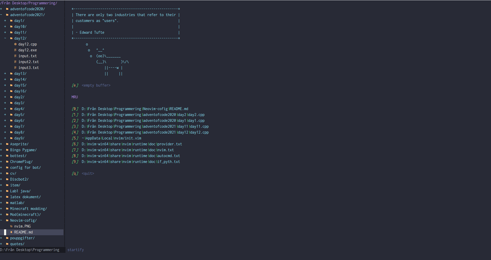

# Neovim-config

A readme for when I forget how to do this.

Note:
Make sure you have Python3 and Nodejs installed.
Also download a [Nerd Font](https://www.nerdfonts.com/font-downloads)(for the devicons to work). I chose Inconsolata.

# TODO: Change this picture




1. Open Neovim
2. Run:
```
:call mkdir(stdpath('config'), 'p')
:exe 'edit '.stdpath('config').'/init.vim'
```
3. If on windows, make sure python3 is installed and can be executed by running python3 in terminal
4. If on Windows run the following:
```
iwr -useb https://raw.githubusercontent.com/junegunn/vim-plug/master/plug.vim |`
    ni $HOME/vimfiles/autoload/plug.vim -Force
```
If on Unix/Linux
```
sh -c 'curl -fLo "${XDG_DATA_HOME:-$HOME/.local/share}"/nvim/site/autoload/plug.vim --create-dirs \
       https://raw.githubusercontent.com/junegunn/vim-plug/master/plug.vim'
```
If on Linux(Flatpak(This means you have the flatpak version of Neovim!!!!!)):
```
curl -fLo ~/.var/app/io.neovim.nvim/data/nvim/site/autoload/plug.vim --create-dirs \
    https://raw.githubusercontent.com/junegunn/vim-plug/master/plug.vim
```

If these fail, [go here](https://github.com/junegunn/vim-plug)

5. Copy init.vim:

5.2 (Optional) If you want Atom One Dark theme, replace 
```
colorscheme name
```
with
```
let g:onedark_config = {
    \ 'style': 'darker',
\}
colorscheme onedark
```
and add the following under call plug#begin()
```
Plug 'navarasu/onedark.nvim'
```
More info on onedark [here](https://github.com/navarasu/onedark.nvim)

6. Restart Neovim

7. Execute
```
:PlugInstall
```
Then
```
:PlugUpdate
```
for good measure.

8. Restart again

9. Run
```
:checkhealth provider
```
and follow instructions there if errors are occuring.
If on Windows, you probably need to follow the steps in:
```
:h provider-python
```
10. If everything seems to work, run:
```
:NERDTree
```
and navigate to where you want it to default when starting Neovim. Then, run:
```
:Bookmark "NameOfBookmark"
```
Without quotation marks!! I set "NameOfBookmark" to "code"

11. Add these to init.vim (at the bottom, don't know if order matters here):
```
autocmd VimEnter * Startify
autocmd VimEnter * NERDTree code
```
where, "code" is "NameOfBookmark".

Information about terminal inside NVIM can be found [here](https://neovim.io/doc/user/nvim_terminal_emulator.html)

Nvim treesitter needs to install every language seperatly, do this with
```
:TSInstall <name of code language>
```

Use ```:checkhealth``` to see if you need a clipboard provider. (like xclip)

Keybindings: (More on windows and tabs [here](https://neovim.io/doc/user/windows.html))
```
T to open new tab (from NERDTree)
s to open file split vertical
F2 to toggle NERDTree
Ctrl+left and Ctrl+right to change tabs
Ctrl+w then H J K L to move windows (Capital HJKL)
Ctrl+w then hjkl or arrow keys to switch window (move cursor)
Ctrl+w = will increase height of current window
Ctrl+w v will split current window vertically
Ctrl+\+n to enter normal mode again when in :terminal(MEGA USEFUL)

While in NERDTree, press m to open NERDTree menu
```
